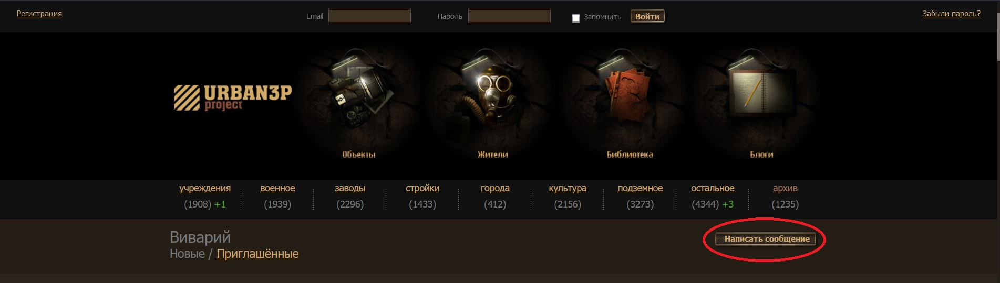
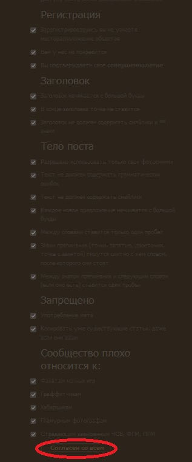
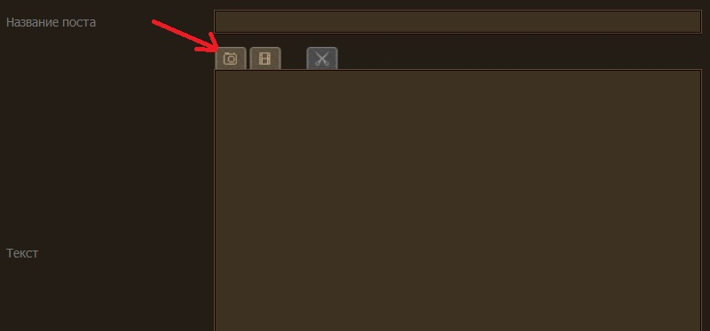
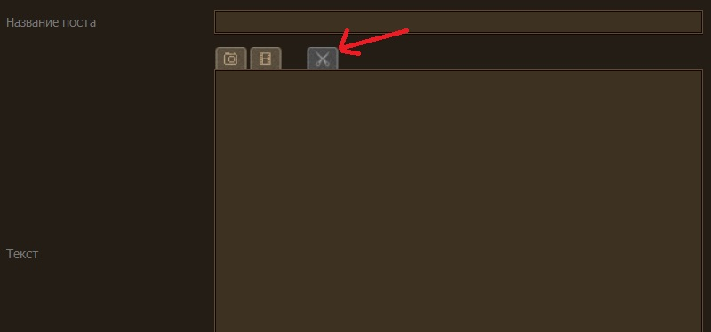

Памятка сталкеру
===============================================
Содержание
----------
- [Как зарегистрироваться на urban3p.ru](#как-зарегистрироваться-на-urban3pru)
- [Карты каменоломен](#карты-каменоломен)
- [Предупреждения](#предупреждения)
- [Снаряжение](#снаряжение)
- [Одежда](#одежда)
- [Обувь](#обувь)
- [Фонари](#фонари)
- [Правила поведения](#правила-поведения)
    - [Правила в заброшках](#правила-в-заброшках)
    - [Правила в каменоломнях](#правила-в-каменоломнях)
    - [Правила в подземных реках](#правила-в-подземных-реках)
- [Подготовка к посещению заброшки](#подготовка-к-посещению-заброшки)
- [Уголовный кодекс](#уголовный-кодекс)
- [Полезные ссылки](#полезные-ссылки)

Как зарегистрироваться на urban3p.ru
------------------------------------
1. Перейти по ссылке https://urban3p.ru/vivarium.
2. Нажать на кнопку "Написать сообщение".

3. Согласиться со всеми правилами - проставить слева галочки и нажать на кнопку "Согласен со всем".

4. Заполнить все поля, написать адекватный отчёт о посещении объекта, приложив хорошие фотографии. Фотография вставляется нажатием на кнопку с иконкой фотоаппарата по прямой ссылке. Поэтому фото придётся сначала разместить на одном из сервисов, предоставляющих доступ по прямой ссылке. Например: http://postimages.org.

Для вивария неважно, насколько объект баян. Важно то, как его подать. В идеале должны быть фотографии, сделанные на мыльницу и обработанные в фотошопе или лайтруме. Но если фотоаппарата нет, то можно обработать и телефонные снимки. Текст смотрят придирчиво, поэтому если нет уверенности в орфографии, то лучше прогнать через онлайн проверку на ошибки. Текст нужно грамотно раскидать между фотографиями, чтобы не было восьми фотографий (в виварий больше восьми фото не вставить) подряд под текстом.

5. После написания вступления и первой фотографии нужно нажать на кнопку "кат" с иконкой ножниц - это необходимо для того, чтобы на странице вивариума в списке постов отображалась только вводная часть.

6. После того, как пост набирает 10+ поддержек, приглашение могут прислать жители сайта. Приглашения есть не у всех - только у тех, кто пишет отчёты. Если отчёт жителя сайта набрал от 30 плюсов, то у него появляется одно приглашение.
7. Для получения статуса "pro" и возможности просматривать координаты необходимо ~17 кармы, 700+ рейтинга и добавление, как минимум, одного объекта, которого нет в базе. Одна фотография даёт 5 рейтинга, один объект - 50 рейтинга. Для получения кармы необходимо продолжать писать отчёты.
8. Желательно ознакомиться: [регистрация](https://wiki.urban3p.ru/%D0%A0%D0%B5%D0%B3%D0%B8%D1%81%D1%82%D1%80%D0%B0%D1%86%D0%B8%D1%8F), [проверенный житель](https://wiki.urban3p.ru/%D0%9F%D1%80%D0%BE%D0%B2%D0%B5%D1%80%D0%B5%D0%BD%D0%BD%D1%8B%D0%B9_%D0%B6%D0%B8%D1%82%D0%B5%D0%BB%D1%8C).

Карты каменоломен
------------------------------------
* [Сьяновские каменоломни](maps/Сьяны-RED.png)
* [Камкинская каменоломня (Кисели)](maps/Кисели.jpg)
* [Девятовская каменоломня (Силикаты)](maps/Девятовская_каменоломня_Силикаты.gif)
* [Гурьевские каменоломни (Бяки)](maps/Бяки.jpg) :warning: В первый раз без проводника не ходить!
* [Никитские каменоломни (Никиты)](maps/Никиты.jpg) :warning: КАРТА НЕ ДАЁТ НИКАКИХ ГАРАНТИЙ! Без проводника не ходить!
* [Володарские каменоломни (Володары)](maps/Володары.jpg)
* [Пещера Юбилейная](maps/Юбилейная1.gif)
* [Пещера Юбилейная - система Кошмаров](maps/Юбилейная2.gif)

Предупреждения
------------------------------------
* Грандъ Теплак

[Сообщение из чата](https://t.me/stalker_halt/4720):
>Не знаю с чем связано, но когда я там был несколько месяцев назад, ближе к тупику, мы с напарницей начали чувствовать лёгкое головокружение. Чем дальше шли, тем хуже становилось, и голова начала болеть. Не дойдя до тупика, решили свернуть обратно. Есть подозрение что в ГТ теперь либо воздух совсем не ходит, либо ещё что. На загазованность не похоже. Так что если кто решит туда пойти, следите за самочувствием. Мы когда срочно выбрались, ещё минут 40 сидели и отходили. У обоих адски голова болела.

* Завод Хруничева

[Сообщение из чата](https://t.me/stalker_halt/9178):
>там на заводе хруничева есть подвал
и там то ли сера, то ли еще какое - то говно
но выглядит не безопасно к вдыханию.

Снаряжение
------------------------------------
* Самое важное на заброшке - это надёжный фонарь. Это действительно важнейший спутник в нашем увлечении. В идеале иметь даже два фонаря. Один налобный, с которым удобно долго ходить и лазать. Ну и ручной. К ним обязательно иметь запасной комплект батареек/аккумулятор. Аккумуляторы предпочтительнее. Так как купить один раз аккумулятор гораздо дешевле, чем каждый раз покупать батарейки. Если в течение года покупать батарейки, то на эти же деньги можно было бы купить не один аккумулятор.

* Минимальная аптечка. Пластыри, бинт, жгут, обезболивающее, обеззараживающее типа перекиси, и, конечно же, лекарства от своих персональных болячек вроде астмы.

* Перчатки. Любые. Строительные или тактические типа механиксов. Тут каждый выбирает сам.

* Нож. Само собой не для самообороны. Скорее как просто инструмент. Лично у меня часто была необходимость что-то обрезать/открыть/поддеть. Небольшого ножика хватит.

* Перцовка. Это самое легально средство для самообороны. Собаки, злые дяди и прочая живность так и ждёт, когда ваша задница будет медленно переваливаться через забор. По закону, перцовку продают с 18 лет, но как бы и лазать по заброшкам не совсем законно.

* Рюкзак с небольшим перекусом и водой.

* Остальное докупается только из личных нужд. Вроде мультитула или инструмента посерьёзнее типа болтореза/ломика и прочего.

Одежда
------------------------------------
При залазе в заброшку никакого камуфляжа надевать не надо. Это моментально палит вас. Одно дело, когда возле забора ходят люди в обычной одежде, которые не выделяются из массы, и совершенно другое, когда возле этого же забора ходят чуваки в камуфляже.
Потому совет прост - носить прочную, не яркую одежду тёмных расцветок. Тёмно-синяя и тёмно-серая одежда отлично прячет вечером. Просто чёрная одежда мало того что невероятно быстро пачкается, так ещё и сильно выделяет контур человека на плохоосвещенной территории. В природе, что нас сейчас окружает, нет чисто чёрных предметов. Да и они не двигаются. Камуфляж отлично подойдёт, только если лезть на объект, где уже не просто дед сторож, а куда интереснее. Да и то, в него лучше переодеваться на месте. То есть, притащив в рюкзаке. Олива тоже отлично подойдёт. Ещё лучше "болотная олива" - это серо-коричневая расцветка.

Обувь
------------------------------------
В идеале треккинговые ботинки или кроссовки. В отличие от берц, они имеют гораздо более мягкую подошву. На многих объектах на полу есть песок, который довольно громко хрустит под подошвой. В кроссовках такой хруст будет еле слышен, в отличие от берц. Да и когда человек в берцах ставит ногу на пол, это звучит довольно громко. Потому только треккинги или кроссы. Однако, каждый выбирает сам, в чем ходить и лазать.

Фонари
------------------------------------
* https://fonariki.ru/

* https://nitecore.ru/

* https://fenix-russia.ru/

* http://www.yarkiyluch.ru/

* https://www.armytek.ru/

* https://petzl.ru/headlamps

* https://olight-russia.ru/

* http://convoy.ru/

* https://www.lumintop.ru/

* https://fonarik-market.ru/category/fonari-i-aksessuary/

* https://www.superfonarik.ru/

* http://LumenHouse.ru

* https://eagle-tac.ru/fonari/mx30l4xc/

Правила поведения
------------------------------------
#### Правила в заброшках
1. Не шуметь, не вандалить, думать головой.
2. Что-то непонятное происходит - пора валить. 
3. Кто-то пришёл вас ловить - смотрите предыдущий пункт.
4. Кто-то поранился, но не критично - аптечка в помощь. Нет аптечки - вот и повод её носить. Кто-то серьёзно повредился - вызывать скорую. Там будет не до штрафа и атата от мамки.
5. Провода не трогать - может ебом токнуть.
6. Всегда смотреть под ноги и в целом пространство перед собой.
7. Собак отогнать можно и камнем, но лучше носить перцовку.

#### Правила в каменоломнях
1. Если долезли до конца лестницы, крикните "свободно", чтобы лез следующий.
2. Так как в каменоломнях не ловит связь, оставьте координаты места и контрольное время кому-то. Если по истечении этого времени (+полчаса-час) от вас не будет известий, то идут на ваши поиски.
3. Также надо отметиться в журнале посещений всем составом при входе и выходе, эта запись будет дополнительным подтверждением вашего нахождения в системе.
4. Находясь в системе запрещается копать вверх, ковырять что-либо на потолке, трогать свисающие камни, опорные колонны, бросать петарды, разводить костер.
5. Обвалы в пещере и каменоломнях бывают редко, но обвалоопасных местах воздержитесь от громких криков, шума, топота. Быстро проходите те места, где потолок разрезан множеством трещин или видны отслоившиеся и нависшие пласты.
6. Для перекуса выбирайте места с визуально целым потолком.
7. Когда компания садится отдыхать, желательно выключить фонарики либо направить их вниз/вверх, чтобы не светить друг другу в глаза.
8. В каменоломнях нужно ходить с картами, но если вдруг оказались без нее, то после каждого пролета оборачивайтесь и запоминайте опознавательные знаки, чтобы запомнить, как идти обратно.

#### Правила в подземных реках
1. Всегда ищите инфу про реку, в которую идете.
2. Заранее сообщите кому-то из доверенных людей, что пошли туда-то, и выйдете примерно в какое-то время, которое укажете. Берите с запасом в 2 часа.
3. Не уверены - не идите.
4. Перед тем как вылезать из люка, сидите и слушайте что сверху происходит - люк может оказаться на дороге.
5. С собой запасной свет и батарейки. Если начинает кружиться голова или ещё что, то на выход.
6. Смотрите под ноги. Водобойные ямы - ваш враг. В них может торчать арматура, на которую вы, скорее всего, насядете как шашлык, т.к. ямы бывают по несколько метров в глубину.
7. Смотрите погоду до залаза в реку и прямо перед ним. Дождь = смерть.
8. В подземных реках часто встречается пар и туман, а возле водопадов или просто перепадных камерах образуется водяная взвесь. Крайне не рекомендуется долго находиться в этой среде, так как очень много бактерий. Рекомендую надевать респиратор с фильтрами от органических газов и прочей херни. Но лучше просто уйти подальше.
9. Не рекомендую сидеть долго там, где растёт плесень. Привал можно устроить и в другом месте.
10. И самое главное правило, которое касается всех объектов, - никогда не ходите одни. Если что, никто не поможет, а в блоге "происшествия на объектах" появится ваше имя.

Подготовка к посещению заброшки
------------------------------------
Прежде чем куда-то забраться, необходимо изучить место по картам и сайтам. Посмотреть что за организация там была, что там сейчас, и стоит ли туда вообще ехать. Смотреть стоит ещё и по картам гугл стрит. Так можно увидеть и примерное состояние, и будки чопов, есть ли забор рабицей и прям у дороги, и много чего ещё. После этого планировать день поездки. В выходные или будни - стоит смотреть в зависимости от объекта. Если есть какие-то действующие части, то в будни можно встретить работягу, а в выходные активизируются чопы и прочая охранная нечисть. Рекомендую обойти объект, типа просто гуляете, и поглядывать на наличие камер, охраны, возможных залазов и прочего. Залаз стоит искать либо в каких-то местах где много растительности, либо что-то альтернативное, типа теплосетей, которые идут на территорию.

Уголовный кодекс
------------------------------------
При посещении охраняемого объекта имейте в виду, чем это грозит.

#### УК РФ Статья 215.4. Незаконное проникновение на охраняемый объект
1. Незаконное проникновение на подземный или подводный объект, охраняемый в соответствии с законодательством Российской Федерации о ведомственной или государственной охране, совершенное неоднократно, - наказывается штрафом в размере до пятисот тысяч рублей или в размере заработной платы или иного дохода осужденного за период до восемнадцати месяцев, либо ограничением свободы на срок до двух лет, либо лишением свободы на тот же срок.
2. То же деяние:

    а) совершенное группой лиц по предварительному сговору или организованной группой;
    
    б) сопряженное с умышленным созданием угрозы распространения сведений, составляющих государственную тайну,

\- наказывается штрафом в размере до семисот тысяч рублей или в размере заработной платы или иного дохода осужденного за период до двух лет либо лишением свободы на срок до четырех лет.

**Примечание.** *Проникновение на указанные в настоящей статье объекты признается незаконным, если оно совершено в нарушение установленного законодательством Российской Федерации порядка, а совершенным неоднократно, - если совершено лицом, подвергнутым административному наказанию за аналогичное деяние, в период, когда лицо считается подвергнутым административному наказанию.*

Собственнику заброшки также может грозить наказание, если вы пострадаете, находясь на объекте.

#### УК РФ Статья 118. Причинение тяжкого вреда здоровью по неосторожности.
1. Причинение тяжкого вреда здоровью по неосторожности наказывается штрафом в размере до восьмидесяти тысяч рублей или в размере заработной платы или иного дохода осужденного за период до шести месяцев, либо обязательными работами на срок до четырехсот восьмидесяти часов, либо исправительными работами на срок до двух лет, либо ограничением свободы на срок до трех лет, либо арестом на срок до шести месяцев.
2. То же деяние, совершенное вследствие ненадлежащего исполнения лицом своих профессиональных обязанностей, наказывается ограничением свободы на срок до четырех лет, либо принудительными работами на срок до одного года с лишением права занимать определенные должности или заниматься определенной деятельностью на срок до трех лет или без такового, либо лишением свободы на срок до одного года с лишением права занимать определенные должности или заниматься определенной деятельностью на срок до трех лет или без такового.

#### УК РФ Статья 214. Вандализм.
1. Вандализм, то есть осквернение зданий или иных сооружений, порча имущества на общественном транспорте или в иных общественных местах, \-
наказывается штрафом в размере до сорока тысяч рублей или в размере заработной платы или иного дохода осужденного за период до трех месяцев, либо обязательными работами на срок до трехсот шестидесяти часов, либо исправительными работами на срок до одного года, либо арестом на срок до трех месяцев.
2. Те же деяния, совершенные группой лиц, а равно по мотивам политической, идеологической, расовой, национальной или религиозной ненависти или вражды либо по мотивам ненависти или вражды в отношении какой-либо социальной группы, \-
наказываются ограничением свободы на срок до трех лет, либо принудительными работами на срок до трех лет, либо лишением свободы на тот же срок.

#### УК РФ Статья 139. Нарушение неприкосновенности жилища.
1. Незаконное проникновение в жилище, совершенное против воли проживающего в нем лица, \-
наказывается штрафом в размере до сорока тысяч рублей или в размере заработной платы или иного дохода осужденного за период до трех месяцев, либо обязательными работами на срок до трехсот шестидесяти часов, либо исправительными работами на срок до одного года, либо арестом на срок до трех месяцев.
2. То же деяние, совершенное с применением насилия или с угрозой его применения, \-
наказывается штрафом в размере до двухсот тысяч рублей или в размере заработной платы или иного дохода осужденного за период до восемнадцати месяцев, либо исправительными работами на срок до двух лет, либо принудительными работами на срок до двух лет, либо лишением свободы на тот же срок.
3. Деяния, предусмотренные частями первой или второй настоящей статьи, совершенные лицом с использованием своего служебного положения, \-
наказываются штрафом в размере от ста тысяч до трехсот тысяч рублей или в размере заработной платы или иного дохода осужденного за период от одного года до двух лет, либо лишением права занимать определенные должности или заниматься определенной деятельностью на срок от двух до пяти лет, либо принудительными работами на срок до трех лет, либо арестом на срок до четырех месяцев, либо лишением свободы на срок до трех лет.

**Примечание.** *Под жилищем в настоящей статье, а также в других статьях настоящего Кодекса понимаются индивидуальный жилой дом с входящими в него жилыми и нежилыми помещениями, жилое помещение независимо от формы собственности, входящее в жилищный фонд и пригодное для постоянного или временного проживания, а равно иное помещение или строение, не входящие в жилищный фонд, но предназначенные для временного проживания.*

#### УК РФ 283.1. Незаконное получение сведений, составляющих государственную тайну.
1. Получение сведений, составляющих государственную тайну, путем похищения, обмана, шантажа, принуждения, угрозы применения насилия либо иным незаконным способом (при отсутствии признаков преступлений, предусмотренных статьями 275 и 276 настоящего Кодекса) \-
наказывается штрафом в размере от двухсот тысяч до пятисот тысяч рублей или в размере заработной платы или иного дохода осужденного за период от одного года до трех лет либо лишением свободы на срок до четырех лет.
2. То же деяние, если оно:

    а)  совершено группой лиц;
    
    б) совершено с применением насилия;

    в) повлекло наступление тяжких последствий;

    г) совершено с использованием специальных и иных технических средств, предназначенных для негласного получения информации;

    д) сопряжено с распространением сведений, составляющих государственную тайну, либо с перемещением носителей таких сведений за пределы Российской Федерации,

\- наказывается лишением свободы на срок от трех до восьми лет.

#### КоАП РФ 20.17. Нарушение пропускного режима охраняемого объекта
1. Самовольное проникновение на охраняемый в установленном порядке объект, за исключением случаев, предусмотренных частью 2 настоящей статьи, \-
влечет наложение административного штрафа в размере от трех тысяч до пяти тысяч рублей с конфискацией орудия совершения административного правонарушения или без таковой.
2. Самовольное проникновение на подземный или подводный объект, охраняемый в соответствии с законодательством Российской Федерации о ведомственной или государственной охране, если это действие не содержит признаков уголовно наказуемого деяния, \-
влечет наложение административного штрафа в размере от семидесяти пяти тысяч до двухсот тысяч рублей с конфискацией орудия совершения административного правонарушения или без таковой либо административный арест на срок до пятнадцати суток с конфискацией орудия совершения административного правонарушения или без таковой.

Полезные ссылки
------------------------------------
* https://urban3p.ru
* [Карты подземных рек Москвы](https://podzemreki.ru/%D0%BA%D0%B0%D1%80%D1%82%D1%8B-%D1%80%D0%B5%D0%BA/)
* [Сталкерская энциклопедия ксенобиологии](http://diggipedia.ru/index.php?title=%D0%97%D0%B0%D0%B3%D0%BB%D0%B0%D0%B2%D0%BD%D0%B0%D1%8F_%D1%81%D1%82%D1%80%D0%B0%D0%BD%D0%B8%D1%86%D0%B0)
* [Карта Москвы 1968г](http://retromap.ru/051968_0020091_z13_55.753845,37.626800)
* [Заброшенные места в гугл](https://www.google.com/maps/d/u/0/viewer?mid=1k2xGB_tLl0gj7rkmyADLMm_IFkY&ll=55.943727054839975%2C37.97045815106311&z=9)
* [Коллекция фотографий и координат заброшек](https://www.rad-x-book.com/)
* [Заброшенные места Москвы и МО](http://psi-lab.ru/zabroshki.html)
* [Ещё один сайт с заброшенными местами Москвы](https://www.2do2go.ru/msk/zabroshennye-mesta)
* [И ещё](https://moskva-x.ru/xzabrosh0)
* [И ещё](https://places.moscow/interesting/zabroshenniye_mesta_moskvy_podmoskovya/zabroshenniye_mesta_moskvy_podmoskovya.html)
